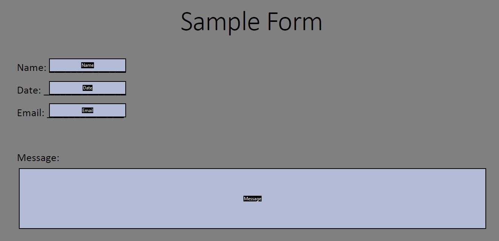
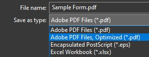
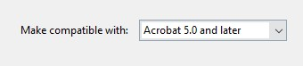

# Template-ify PDF

Template-ify is a small PHP tool to fill and flatten PDF forms programmatically, without the need for tools such as [PDFtK](https://www.pdflabs.com/tools/pdftk-the-pdf-toolkit/) installed on the server.

## Installation

Add jdoolittle126/templateify-pdf in composer.json, or use the command:

    composer require jdoolittle126/templateify-pdf

## Usage

Template-ify takes a template PDF file and data, and produces filled PDF files. Optionally, these PDFs can also be flattened to prevent further edits. Form data is added via a 'fields' array, containing key - value pairs. The key refers to the name of the form field, and the value is the data to be entered. One caveat is that the template PDF must be of version 1.4
(Acrobat 5.x) or lower. See [Changing the PDF Version](#Changing the PDF Version).

### Preparing a Template

After creating a PDF form, take note of the field names. The values `Name`, `Date`, `Email`, and `Message` will be used to identify the fields.



### Changing the PDF Version

When saving your template, be sure to choose `Adode PDF Files, Optimized`. This will reveal a settings menu that will allow the PDF to be saved in a compatibility mode required for this program to function.



In the settings dialog, select `Make compatible with: 'Acrobat 5.0 and later'`



### Usage

The main function, `Templateifier::templateify`, takes 4 arguments. 

- The first is `$pdfFile`, the path to the template PDF file (Ex. "docs/my_form.pdf")
- The second is `$outputFile`, the path where the output PDF will be created (Ex. "output/my_result.pdf")
- The third is `$flatten`, true if the outputted document should be flattened, false if not
- Forth is `$fields`, an array of field - value pairs
- Optionally, there is a `$results` parameter, which will store an exception if one occurs

```
    $pathToPdfTemplate = "path\\to\\your\\pdf";
    $pathToOutputFile = "path\\to\\your\\output\\output.pdf";
    $flattenOutput = false;
    $fields = array(
        'Name' => 'John Doe',
        'Date' => date("Y/m/d"),
        'Email' => 'johndoe@email.com',
        'Message' => 'This is a sample message that we can transfer to a PDF!'
    );

    Templateifier::templateify($pathToPdfTemplate, $pathToOutputFile, $flattenOutput, $fields);
   ```
